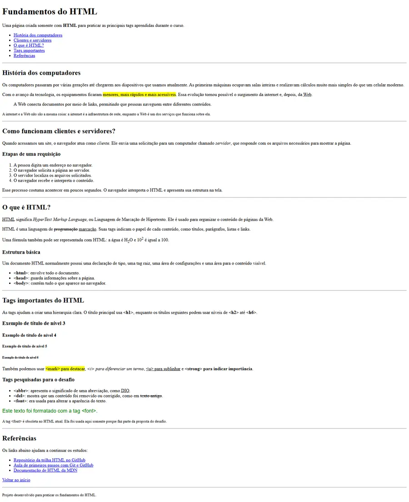

<div align="center">

# 📘 Fundamentos do HTML

### Uma página educacional criada para praticar as principais tags do HTML


</div>

---

## 📖 Sobre o projeto

Este projeto foi desenvolvido durante o **Módulo 1 da Formação HTML Web Developer da DIO**.

O desafio propõe a criação de uma página utilizando somente HTML, reunindo em um único documento as principais tags apresentadas nas aulas e algumas tags pesquisadas durante o desenvolvimento.

O conteúdo da página apresenta conceitos introdutórios sobre computadores, clientes e servidores, estrutura do HTML e referências para continuar os estudos.

> 💡 O projeto utiliza **HTML puro**, sem CSS e sem JavaScript, respeitando a proposta original do desafio.

## 🎯 Objetivos do desafio

- Praticar a estrutura básica de um documento HTML;
- Criar uma hierarquia de títulos do `<h1>` ao `<h6>`;
- Formatar e destacar partes importantes do texto;
- Organizar informações utilizando listas;
- Criar links internos e externos;
- Pesquisar e aplicar novas tags HTML;
- Produzir uma página organizada, acessível e fácil de navegar.

## 🏷️ Tags utilizadas

| Categoria | Tags |
| --- | --- |
| Estrutura | `<html>`, `<head>`, `<body>`, `<header>`, `<main>`, `<section>` e `<footer>` |
| Títulos | `<h1>`, `<h2>`, `<h3>`, `<h4>`, `<h5>` e `<h6>` |
| Textos | `<p>`, `<small>`, `<blockquote>` e `<abbr>` |
| Formatação | `<mark>`, `<i>`, `<u>`, `<strong>`, `<del>` e `<font>` |
| Listas | `<ol>`, `<ul>` e `<li>` |
| Navegação | `<a>` |
| Organização | `<hr>` |
| Fórmulas | `<sub>` e `<sup>` |

## 🧠 Conteúdos apresentados

1. História dos computadores;
2. Funcionamento de clientes e servidores;
3. Conceito e estrutura básica do HTML;
4. Principais tags de marcação;
5. Novas tags pesquisadas para o desafio;
6. Referências para continuar os estudos.

## 🖼️ Captura da página



## 📁 Estrutura do repositório

```text
HTML-Fundamentals-Challenge/
├── index.html
├── LICENSE
├── README.md
└── screenshots/
    └── pagina-fundamentos-html.webp
```

## 🚀 Como executar

1. Faça o download ou clone este repositório:

```bash
git clone https://github.com/SamuelMonsalvesMoreira/HTML-Fundamentals-Challenge.git
```

2. Abra a pasta do projeto.
3. Clique duas vezes no arquivo `index.html`.

Não é necessário instalar dependências nem executar um servidor.

## 📚 Referências

- [Repositório da trilha HTML da DIO](https://github.com/digitalinnovationone/trilha-html-modulo-1)
- [Documentação HTML da MDN](https://developer.mozilla.org/pt-BR/docs/Web/HTML)
- [Documentação do GitHub](https://docs.github.com/pt)

## 📄 Licença

Este projeto está disponível sob a licença presente no arquivo [LICENSE](LICENSE).

---

<div align="center">

Desenvolvido por **Samuel Monsalves Moreira** para o desafio da **DIO**.

</div>

